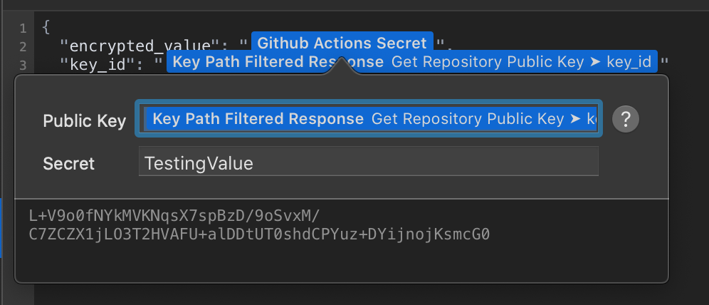

# Paw.cloud Github Actions Secret Dynamic Value
This plugin allows you to generate the LibSodium encrypted secret from within Paw.


## Usage
When creating a request to the github API, you can add this dynamic value extenison to automatically encrypt the secret for the request per the [Github Secrets Documentation](https://docs.github.com/en/free-pro-team@latest/rest/reference/actions#secrets). Follow the steps below to begin making calls through Paw.cloud to generate secrets for your repo.

1. [Get your repo's public key](https://docs.github.com/en/free-pro-team@latest/rest/reference/actions#get-a-repository-public-key)

2. From the response of the call from step 1, get the dynamic value path for the `key`. Also make note of the dynamic value path for the `key_id`

3. Use the `key` and `key_id` path in the request to create a new secret.



## Contributing

### Prerequisites
```shell
nvm install
nvm use
npm install
```

### Build
```shell
npm run build
```

### Install
This will install the paw extension into the default location for paw extensions.
```shell
make install
```

## License

This Paw Extension is released under the [MIT License](LICENSE). Feel free to fork, and modify!

Copyright © 2020 Brian Retterer